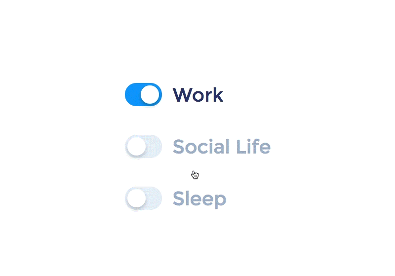

<h1 align="center">👋 Hello, I'm AruNi_Lu</h1>

 

 
 

<!--

-->

## Skill Set

  
  &emsp;
 &emsp; 
 &emsp; 
  &emsp;
  &emsp;
  &emsp;
  &emsp;
  &emsp;
  &emsp;
  &emsp;
  &emsp;
  &emsp;
   &emsp;
  &emsp;
  &emsp;
 &emsp;
  &emsp;
  &emsp;

 

 
|  |  &emsp;&emsp;&emsp;&emsp;&emsp;|
| ------------- | ------------- |

 

  

 

Generated using <a href="https://profilinator.rishav.dev/" target="_blank">Github Profilinator</a>

